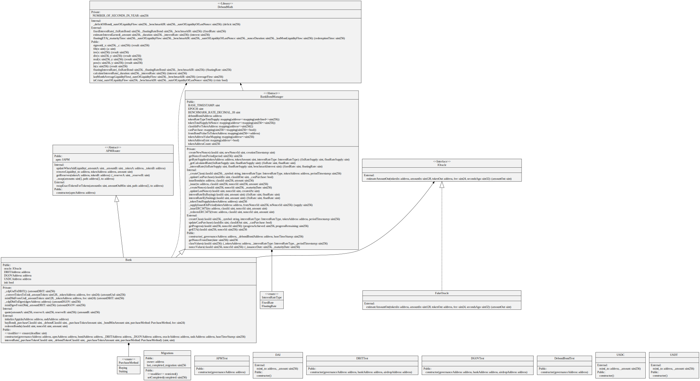

## Debond-Bank:

this repository consist of the contracts  that manage the issuance , redemption and  liquidity  of the bonds. it consist of the following main contracts : 

1.  Bank Contract : This contract acts as orchestrator / wrapper interface  for the by providing wrapper function for  bonds, it handles the portfolio of class and nonce of bonds that are agreed upon by the governance, and primarily does the following : 

    - issuers to buy the bonds , whilst depositing the underlying collateral (issued with equal amount of DBIT token) to APM. 
    -  redeeming the bonds, based on the condition of redemption time condition .
    - getter functions for 
        - fetching the interest rate of staking / buying bonds.
        - getting  CDP (collateral determined price)  for determining the amount of tokens in LP pair. 

for the bond issuance / redemption, we follow different logic based on the different category of bonds as explained below:
    - if the bond is bought for the staking purposes, the amount of the bonds issued is equivalent to the (amount * rate-of-interest) of the bond, where the `rate-of-interest` depends on the fixed rate or floating nature bond. 
    
    - else if its bought for issuing the bonds, then the APM receives  `amount(1 + amount* rate)`of bonds. and further rate depends on the nature of bond (fixed / floating).

2. BankBondManager : this contract implements the core logic for managing the bond lifecycle, for instance :
    - instantiating the bond class.
    - overriding the implementation of ERC-3475 implementation like getProgress() , classValues and NonceValues.
    - nonce creation and nonce generation.  

2. APM: 
    -  this contract acts as consolidated pool for all the bonds issued  by the bank for the user. 

## diagram (UML)

### for interfaces 

## Deployed contracts: 
Verifying DAI
Already Verified: https://rinkeby.etherscan.io/address/0xf3E0bF9A5D4Ac5d48f14361d8Dd0Ba7984238645#code

Verifying DBITTest
Already Verified: https://rinkeby.etherscan.io/address/0x52a48fbbfF33f936b0B0d7d4e2a9b5bB35779b64#code

Verifying DGOVTest
Already Verified: https://rinkeby.etherscan.io/address/0x222c41e58C56Ce2A54EF01a2d0d05055BA2CD51D#code

Verifying USDC
Already Verified: https://rinkeby.etherscan.io/address/0x313d0aaAf4210ae280696C0447c752C2D3A32C3b#code

Verifying USDT
Already Verified: https://rinkeby.etherscan.io/address/0x9d155EDb3c43093F08B331A84c5D71ebA53f9321#code

Verifying FakeOracle
Already Verified: https://rinkeby.etherscan.io/address/0xb84bf772166467E5D475Ce38A9a04ECc5EE8B663#code

Verifying Bank
Pass - Verified: https://rinkeby.etherscan.io/address/0xd9F6aEbEd44ea0071c1929b2bf5a3Dd671c39006#code

Verifying DebondBondTest
Already Verified: https://rinkeby.etherscan.io/address/0x3BD339C9a8c3321E94Dd1644243b3448f73b7BE8#code

Verifying APMTest
Already Verified: https://rinkeby.etherscan.io/address/0xA361763C11cf4D55bD0356b4921D781BEa558325#code

Verifying DebondMath
Pass - Verified: https://rinkeby.etherscan.io/address/0xcEC56a9d7c618A0D710d362e123B979716F427fA#code
